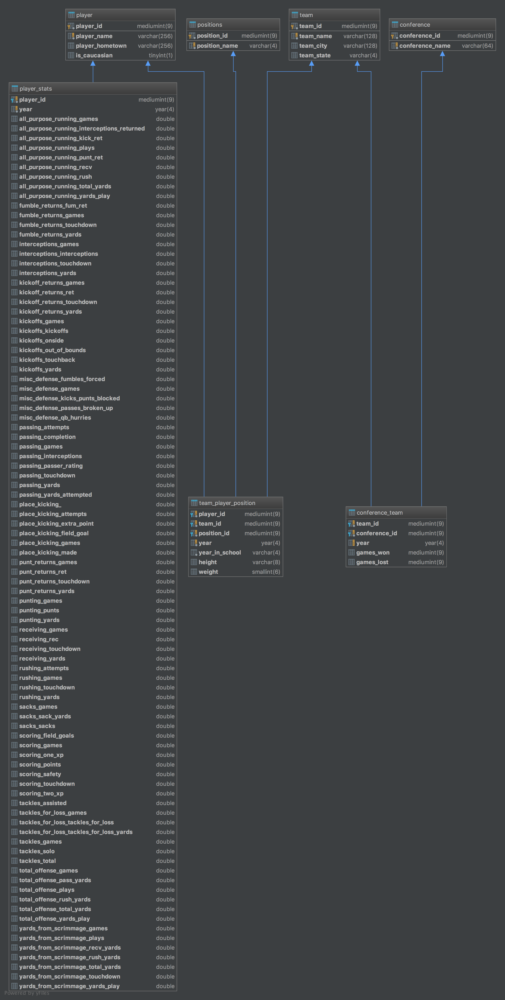
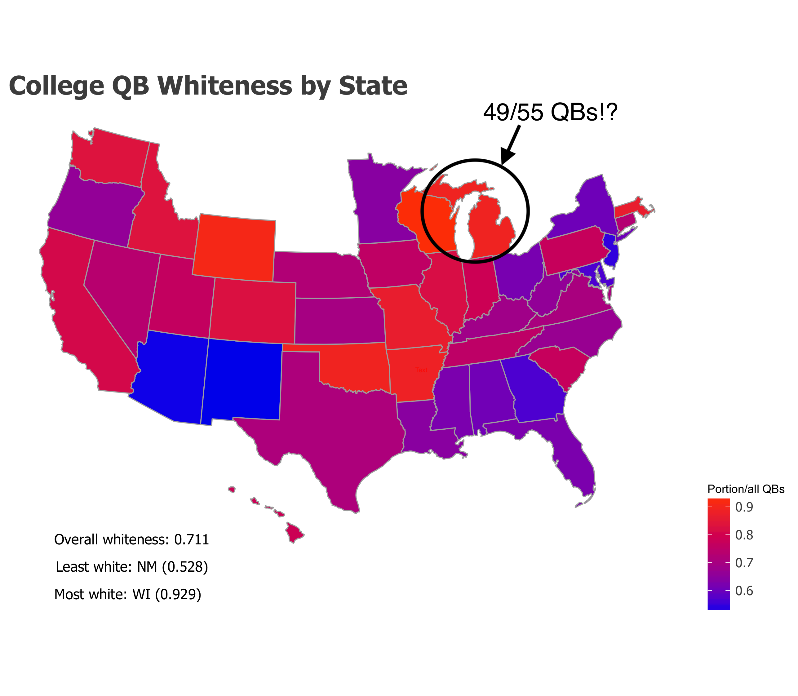
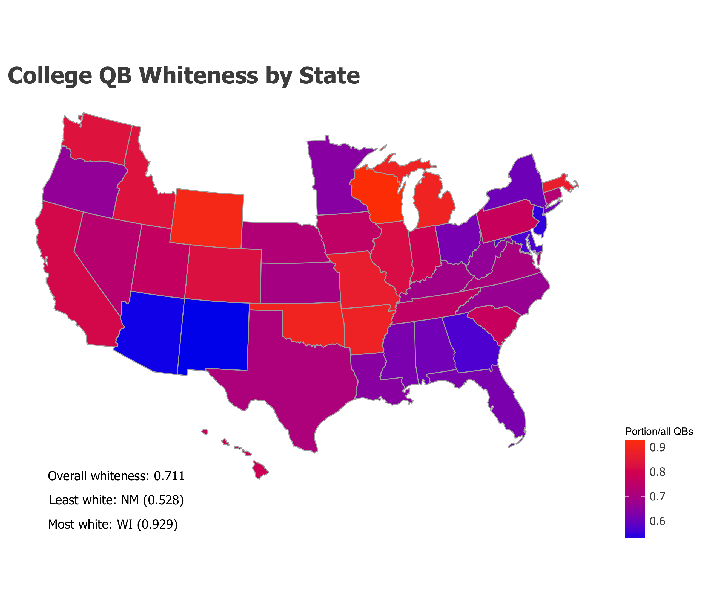

# NCAA football quarterback racial equity analysis

Caveat: I'm not a football afficionado. In fact, I'm a football n00b, even more n00by when it comes to matters of college football. But during one fall afternoon in the height of the [Colin Kaepernick kneel for the anthem movement](https://www.washingtonpost.com/graphics/2017/sports/colin-kaepernick-national-anthem-protests-and-NFL-activism-in-quotes/?utm_term=.b9e537c5d3d6), I was out running errands and somewhere ESPN was blaring on a TV; they were playing college football highlight reels from the morning's games. They featured three games, where all six of the quarterbacks were white. Seemed lopsided, I thought, especially because the recent NFL activism had brought to light the fact that 70% of NFL players are black. What were the odds that all six of the quarterbacks would be white?

According to [The Institute for Diversity and Ethics in Sport](https://theundefeated.com/features/the-nfls-racial-divide/), white guys consistently comprised about 80% of the quarterbacks in the NFL over the last 15 years. Was the same true in college football? What are the patterns? Are there some conferences more biased than others?

This repository contains everything needed to 

1. Set up a MySQL database to hold college football rosters and statistics.
2. Run a web scrape to obtain said data.
3. Load the scraped data into the database.
4. Run some queries and analysis to describe the racial inequities in this position.

## The database
A normal tendency when working on some type of data scraping project is to write one-off functions that will gather specific data every time we run the function. This isn't always a bad idea, but this has three really obvious drawbacks - (1) if the data is dependent on some other data being scraped, we have to run other scrapers first, (2) if the data is large, the scrape could take a while, and (3) if the website changes, the scraper could break.

Instead, it might just be easier to just set up a relational database (e.g. a SQL database), scrape the data once (or at regular periodic intervals), and then write SQL queries to get whatever we need from our own database, whenever we want. 

Even a football outsider like me can get the gist of how a football league works. Here's my stab at the relationships between conferences, teams, and players:

## The data
The data comes from [cfbstats.com](http://www.cfbstats.com/). Each quarterback was hand labelled `is_caucasian`, a "1" meaning "player is caucasian," and "0" indicates otherwise. Those labels are not perfect, but they're what I could ascertain from Google/Google Image searches for all of the 1600 college quarterbacks between 2008 and 2017.

## The outcome
The overall rate of white quarterbacking between 2008 and 2017 in division I college football programs is 71.1%. From the TIDES study mentioned previously, black men comprise 57% of college football teams. So the QB position is unfortunately very disproportionately white, but actually not quite as severe as in the NFL.

The 5 most lopsided states are as follows:

| State         | Fraction of QBs since 2008 that are white |
| :-----------: |:-----------------------------------------:|
| WI            | 13/14                                     |
| WY            | 10/11                                     |
| OK            | 25/28                                     |
| MI            | 49/55 									|
| AR            | 22/25                                     |

When I described that afternoon when I saw those football games with the white quarterbacks on ESPN, I neglected to mention that all of the teams were in the SEC (Southeastern Conference), and I was anticipating for those teams to have the highest rates of white quartbacking. I was wrong. The SEC is in the middle of the pack with the 5th lowest rate of white quarterbacking out of the 11 conferences, although the distribution of white quarterback proportions across conferences is pretty tight, only ranging from 64% to 77%:

| Conference                   | Fraction of QBs since 2008 that are white |
| :---------------------------:|:-----------------------------------------:|
| Atlantic Coast Conference    | 0.642                                     |
| American Athletic Conference | 0.663                                     |
| Sun Belt Conference          | 0.674                                     |
| Conference USA               | 0.696                                     |
| Southeastern Conference      | 0.696                                     |
| Mountain West Conference     | 0.711                                     |
| Independent   		       | 0.741                                     |
| Pac-12 Conference            | 0.742                                     |
| Big 12 Conference            | 0.758                                     |
| Mid-American Conference      | 0.762                                     |
| Big Ten Conference           | 0.771                                     |

The trends in QB whiteness, similar to the NFL statistics, seem almost constant over the period between 2008 and 2017, although the most equitable conference (the Atlantic Coast Conference) has seen a decrease in whiteness (a move towards equitability) over the last four years, and the mean QB whiteness over all D1 teams has been decreasing for the last three years.

